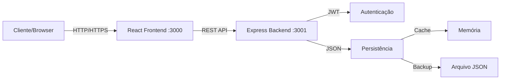

# Sistema de Gerenciamento de Usuários SPS

Sistema completo de gerenciamento de usuários full-stack com autenticação JWT, controle de acesso baseado em funções (RBAC) e operações CRUD completas. Desenvolvido com React no frontend e Express.js no backend.

## 🎯 Visão Geral do Projeto

O SPS é uma aplicação web moderna para gerenciamento de usuários que oferece:

- **Autenticação segura** com JWT tokens
- **Controle de acesso** baseado em funções (Admin/Usuário Padrão)
- **Interface responsiva** com Tailwind CSS
- **API REST** bem documentada com Swagger
- **Internacionalização** (PT-BR, EN, ES)
- **Persistência de dados** com sistema híbrido (memória + arquivo)

## 🏗 Arquitetura do Sistema

```
SPS/
├── test-sps-react/       # Frontend React
│   ├── src/             # Código fonte
│   ├── public/          # Arquivos públicos
│   └── package.json     # Dependências
│
├── test-sps-server/      # Backend Express
│   ├── src/             # Código fonte
│   ├── data/            # Persistência
│   └── package.json     # Dependências
│
└── README.md            # Este arquivo
```

### Arquitetura Técnica



## 🚀 Quick Start (Início Rápido)

### Pré-requisitos

- Node.js v14 ou superior
- npm ou yarn
- Git

### Instalação Completa

```bash
# 1. Clonar o repositório
git clone [url-do-repositorio]
cd SPS

# 2. Instalar dependências do backend
cd test-sps-server
npm install

# 3. Configurar variáveis de ambiente do backend
echo "PORT=3001" > .env
echo "JWT_SECRET=seu_secret_super_secreto_aqui" >> .env
echo "NODE_ENV=development" >> .env

# 4. Instalar dependências do frontend (novo terminal)
cd ../test-sps-react
npm install

# 5. Configurar variáveis de ambiente do frontend (opcional)
echo "REACT_APP_API_URL=http://localhost:3001" > .env
```

### Executar o Sistema

**Terminal 1 - Backend:**

```bash
cd test-sps-server
npm run dev
# Servidor rodando em http://localhost:3001
# Swagger disponível em http://localhost:3001/api-docs
```

**Terminal 2 - Frontend:**

```bash
cd test-sps-react
npm start
# Aplicação disponível em http://localhost:3000
```

## 🔐 Credenciais de Acesso

### Administrador (Pré-cadastrado)

- **Email:** admin@sps.com
- **Senha:** admin123
- **Permissões:** Acesso total ao sistema

## 🛠 Stack Tecnológica

### Frontend (test-sps-react)

| Tecnologia      | Versão | Descrição                    |
| --------------- | ------ | ---------------------------- |
| React           | 18.x   | Biblioteca de UI             |
| Tailwind CSS    | 3.x    | Framework CSS utilitário     |
| React Router    | 6.x    | Roteamento SPA               |
| Axios           | 1.x    | Cliente HTTP                 |
| React Hook Form | 7.x    | Gerenciamento de formulários |
| React Toastify  | 9.x    | Notificações toast           |
| Context API     | -      | Gerenciamento de estado      |

### Backend (test-sps-server)

| Tecnologia        | Versão | Descrição              |
| ----------------- | ------ | ---------------------- |
| Node.js           | 14+    | Runtime JavaScript     |
| Express           | 4.x    | Framework web          |
| JWT               | 9.x    | Autenticação por token |
| bcryptjs          | 2.x    | Hash de senhas         |
| Swagger UI        | 5.x    | Documentação da API    |
| express-validator | 7.x    | Validação de dados     |
| cors              | 2.x    | Política CORS          |
| dotenv            | 16.x   | Variáveis de ambiente  |

## 📚 Funcionalidades do Sistema

### Módulo de Autenticação

- ✅ Login com email e senha
- ✅ Tokens JWT com expiração de 24h
- ✅ Logout com limpeza de sessão
- ✅ Verificação de autenticação em rotas protegidas
- ✅ Renovação automática de sessão

### Módulo de Usuários

- ✅ **Criar** - Adicionar novos usuários (Admin)
- ✅ **Listar** - Visualizar todos os usuários
- ✅ **Visualizar** - Detalhes de usuário específico
- ✅ **Editar** - Atualizar informações (Admin)
- ✅ **Excluir** - Remover usuários (Admin)
- ✅ **Validações** - Email único, campos obrigatórios

### Módulo de Internacionalização

- ✅ Português (PT-BR) - Padrão
- ✅ Inglês (EN)
- ✅ Espanhol (ES)
- ✅ Troca de idioma em tempo real
- ✅ Persistência de preferência

### Módulo de Segurança

- ✅ Autenticação JWT
- ✅ Hash bcrypt para senhas
- ✅ Validação de entrada (frontend e backend)
- ✅ Sanitização de dados
- ✅ Proteção contra XSS
- ✅ Configuração CORS

## 📂 Estrutura de Pastas Detalhada

```
SPS/
├── test-sps-react/                 # FRONTEND
│   ├── public/                    # Arquivos estáticos
│   ├── src/
│   │   ├── components/           # Componentes reutilizáveis
│   │   │   ├── Layout.js        # Layout principal
│   │   │   ├── PrivateRoute.js  # Rotas protegidas
│   │   │   ├── UserForm.js      # Formulário de usuário
│   │   │   └── LanguageSwitcher.js # Seletor de idioma
│   │   ├── contexts/             # Contextos globais
│   │   │   ├── AuthContext.js   # Contexto de autenticação
│   │   │   └── I18nContext.js   # Contexto de i18n
│   │   ├── pages/                # Páginas/Views
│   │   │   ├── Home.js          # Dashboard
│   │   │   ├── SignIn.js        # Login
│   │   │   ├── Users.js         # Listagem
│   │   │   ├── UserCreate.js    # Criar usuário
│   │   │   └── UserEdit.js      # Editar usuário
│   │   ├── services/             # Serviços de API
│   │   │   └── UserService.js   # Comunicação com backend
│   │   ├── index.js              # Entry point
│   │   └── routes.js             # Configuração de rotas
│   └── README.md                 # Documentação do frontend
│
├── test-sps-server/                # BACKEND
│   ├── data/                      # Dados persistentes
│   │   └── users.json            # Banco de dados JSON
│   ├── src/
│   │   ├── config/               # Configurações
│   │   │   ├── swagger.js       # Config Swagger
│   │   │   └── swagger.json     # Spec OpenAPI
│   │   ├── controllers/          # Controladores
│   │   │   ├── authController.js # Autenticação
│   │   │   └── userController.js # CRUD usuários
│   │   ├── database/             # Camada de dados
│   │   │   ├── inMemoryDb.js    # Cache em memória
│   │   │   └── persistence.js   # Persistência arquivo
│   │   ├── middleware/           # Middlewares
│   │   │   ├── auth.js          # Autenticação JWT
│   │   │   └── errorHandler.js  # Tratamento de erros
│   │   ├── services/             # Lógica de negócio
│   │   │   ├── authService.js   # Serviço de auth
│   │   │   └── userService.js   # Serviço de usuários
│   │   ├── utils/                # Utilitários
│   │   │   └── validators.js    # Validadores
│   │   ├── index.js              # Entry point
│   │   └── routes.js             # Definição de rotas
│   └── README.md                 # Documentação do backend
│
└── README.md                       # Documentação principal
```

## 🔄 Fluxo de Dados

1. **Requisição do Cliente**: Browser envia requisição HTTP
2. **Processamento Frontend**: React Router gerencia navegação
3. **Chamada API**: Axios envia requisição para backend
4. **Autenticação**: Middleware JWT valida token
5. **Processamento Backend**: Controller processa lógica
6. **Persistência**: Dados salvos em memória e arquivo
7. **Resposta**: JSON retornado ao frontend
8. **Atualização UI**: React renderiza mudanças

## 🌐 Endpoints da API

### Endpoints Públicos

| Método | Rota          | Descrição            |
| ------ | ------------- | -------------------- |
| GET    | `/`           | Health check         |
| POST   | `/auth/login` | Autenticação         |
| GET    | `/api-docs`   | Documentação Swagger |

### Endpoints Protegidos

| Método | Rota            | Descrição           | Permissão |
| ------ | --------------- | ------------------- | --------- |
| GET    | `/auth/profile` | Perfil do usuário   | Todos     |
| GET    | `/users`        | Listar usuários     | Todos     |
| POST   | `/users`        | Criar usuário       | Admin     |
| GET    | `/users/:id`    | Detalhes do usuário | Todos     |
| PUT    | `/users/:id`    | Atualizar usuário   | Admin     |
| DELETE | `/users/:id`    | Excluir usuário     | Admin     |

## 📊 Modelos de Dados

### Modelo de Usuário

```typescript
interface User {
  id: number;
  name: string;
  email: string;
  password: string; // Hash bcrypt
  type: "admin" | "standard";
  createdAt: string; // ISO 8601
  updatedAt: string; // ISO 8601
}
```

### Payload JWT

```typescript
interface JWTPayload {
  id: number;
  email: string;
  type: string;
  iat: number; // Issued at
  exp: number; // Expiration
}
```

## 🚀 Instruções de Deploy

### Deploy do Frontend

#### Vercel

```bash
cd test-sps-react
npm run build
vercel deploy --prod
```

#### Netlify

```bash
cd test-sps-react
npm run build
netlify deploy --prod --dir=build
```

### Deploy do Backend

#### Heroku

```bash
cd test-sps-server
heroku create nome-do-app
heroku config:set JWT_SECRET=seu_secret_aqui
git push heroku main
```

#### PM2 (VPS)

```bash
cd test-sps-server
npm install pm2 -g
pm2 start src/index.js --name sps-api
pm2 save
pm2 startup
```

## 🧪 Testes

O projeto migrou completamente de **Jest** para **Cypress** como framework de testes, oferecendo uma solução integrada para testes E2E, de componentes e de API.

### 🎯 Migração Jest → Cypress

- ✅ **Jest removido completamente** (frontend e backend)
- ✅ **Cypress 13.6.0 implementado** em ambos os projetos
- ✅ **Comandos customizados** para facilitar os testes
- ✅ **Fixtures** com dados de teste mockados
- ✅ **Testes E2E e de componentes** configurados

> 📋 **[Ver guia completo da migração](./MIGRATION_GUIDE.md)**

### Framework de Testes

| Ambiente     | Framework | Tipos de Teste                   |
| ------------ | --------- | -------------------------------- |
| **Frontend** | Cypress   | E2E, Component Testing           |
| **Backend**  | Cypress   | API Testing, Integration Testing |

### Executar Testes

#### Frontend (`test-sps-react`)

```bash
cd test-sps-react

# Abrir Cypress UI para desenvolvimento
npm run test:open

# Executar todos os testes em modo headless
npm test

# Executar apenas testes E2E
npm run cy:e2e

# Executar apenas testes de componentes
npm run cy:component
```

#### Backend (`test-sps-server`)

```bash
cd test-sps-server

# Abrir Cypress UI para desenvolvimento
npm run test:open

# Executar todos os testes em modo headless
npm test
```

### Cobertura de Testes

#### Frontend (E2E + Componentes)

- ✅ **Autenticação**: Login/logout, validações, sessões
- ✅ **Gestão de usuários**: CRUD completo via interface
- ✅ **Formulários**: Validações, estados, interações
- ✅ **Navegação**: Rotas protegidas, redirecionamentos
- ✅ **Internacionalização**: Troca de idiomas
- ✅ **Componentes**: Props, estados, renderização

#### Backend (API Testing)

- ✅ **Endpoints de autenticação**: Login, JWT validation
- ✅ **CRUD de usuários**: GET, POST, PUT, DELETE
- ✅ **Validação de dados**: Campos obrigatórios, formatos
- ✅ **Autorização**: Permissões por tipo de usuário
- ✅ **Códigos de status**: 200, 201, 400, 401, 404, etc.
- ✅ **Estrutura de respostas**: JSON schema validation

### Comandos Customizados

#### Frontend

```javascript
cy.login(); // Login automático
cy.createUser(userData); // Criar usuário via UI
cy.navigateToUsers(); // Navegar para página
cy.setupApiIntercepts(); // Mock APIs
```

#### Backend

```javascript
cy.apiLogin(); // Autenticação via API
cy.apiCreateUser(userData); // Criar usuário via API
cy.setupTestData(); // Preparar dados de teste
cy.validateUserResponse(); // Validar schema JSON
```

### Estrutura dos Testes

```
cypress/
├── e2e/                    # Testes End-to-End
│   ├── auth.cy.js         # Autenticação
│   ├── users.cy.js        # Gestão de usuários
│   ├── auth-api.cy.js     # API de autenticação
│   └── users-api.cy.js    # API de usuários
├── fixtures/              # Dados mockados
│   ├── auth.json         # Dados de autenticação
│   └── users.json        # Lista de usuários
└── support/              # Configurações
    ├── commands.js       # Comandos customizados
    └── e2e.js           # Setup global
```

### Pré-requisitos para Testes

```bash
# 1. Servidor backend rodando
cd test-sps-server && npm run dev

# 2. Servidor frontend rodando (para testes E2E)
cd test-sps-react && npm start

# 3. Executar testes
npm test
```

### Testes em CI/CD

```yaml
test-cypress:
  runs-on: ubuntu-latest
  steps:
    - name: Start Backend
      run: cd test-sps-server && npm run dev &

    - name: Start Frontend
      run: cd test-sps-react && npm start &

    - name: Run Tests
      run: |
        cd test-sps-server && npm test
        cd test-sps-react && npm test
```

## 📈 Roadmap de Desenvolvimento

### Fase 1 - MVP ✅

- [x] Autenticação JWT
- [x] CRUD de usuários
- [x] Interface responsiva
- [x] Documentação Swagger
- [x] Internacionalização
- [x] **Migração completa para Cypress** (E2E + Component + API Testing)

### Fase 2 - Melhorias (Em Planejamento)

- [ ] Banco de dados real (PostgreSQL/MongoDB)
- [ ] Upload de avatar
- [ ] Recuperação de senha
- [ ] Verificação de email
- [ ] Paginação e busca avançada

### Fase 3 - Recursos Avançados

- [ ] Dashboard com métricas
- [ ] Logs de auditoria
- [ ] API rate limiting
- [ ] WebSockets para real-time
- [ ] Testes automatizados completos

### Fase 4 - Enterprise

- [ ] Multi-tenancy
- [ ] SSO (Single Sign-On)
- [ ] 2FA (Two-Factor Authentication)
- [ ] Backup automatizado
- [ ] CI/CD pipeline completo

## 🐛 Solução de Problemas Comuns

### Frontend não conecta ao Backend

- Verifique se o backend está rodando na porta 3001
- Confirme a variável REACT_APP_API_URL
- Verifique configuração CORS no backend

### Token JWT expirado

- Faça logout e login novamente
- Verifique a validade do token (24h)

### Erro ao salvar dados

- Verifique permissões da pasta `data/`
- Delete `users.json` para reset completo

### Porta já em uso

```bash
# Windows
netstat -ano | findstr :3001
taskkill /PID <PID> /F

# Linux/Mac
lsof -i :3001
kill -9 <PID>
```

## 📚 Documentação Detalhada

Para informações mais detalhadas sobre cada parte do sistema:

- 📘 **[Frontend Documentation](./test-sps-react/readme.md)** - Detalhes completos sobre o frontend React
- 📗 **[Backend Documentation](./test-sps-server/readme.md)** - Detalhes completos sobre a API Express
- 📙 **[API Documentation](http://localhost:3001/api-docs)** - Swagger UI interativo (requer servidor rodando)

## 🤝 Contribuindo

1. Fork o projeto
2. Crie uma branch para sua feature (`git checkout -b feature/AmazingFeature`)
3. Commit suas mudanças (`git commit -m 'Add some AmazingFeature'`)
4. Push para a branch (`git push origin feature/AmazingFeature`)
5. Abra um Pull Request

## 📄 Licença

Este projeto está sob licença MIT. Veja o arquivo `LICENSE` para mais detalhes.

## 👥 Equipe

Desenvolvido pela equipe de desenvolvimento SPS.

## 📞 Suporte

Para suporte, envie um email para support@sps.com ou abra uma issue no GitHub.

---

<div align="center">

**Sistema de Gerenciamento de Usuários SPS**

Desenvolvido com ❤️ usando React e Node.js

[Demo](https://sps-demo.com) | [Documentação](https://docs.sps.com) | [Blog](https://blog.sps.com)

</div>
